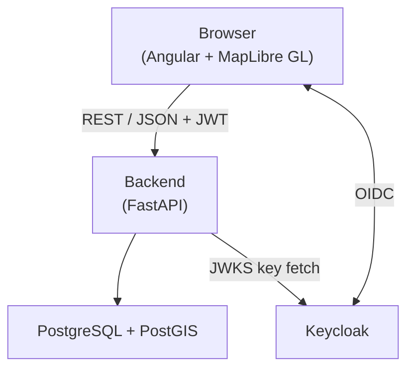
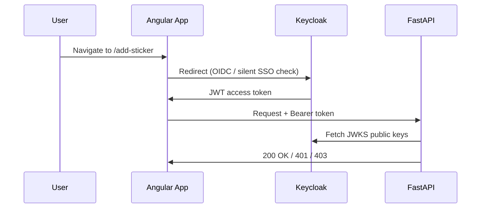

<h1 align="center">
<a href="https://watskebart.github.io/stickermap">StickerMap</a>
</h1>

<p align="center">
<a href="https://github.com/WatskeBart/stickermap/actions/workflows/build-images.yml">
  
</a>
<a href="https://github.com/WatskeBart/stickermap/releases">
  
</a>
<a href="https://github.com/WatskeBart/stickermap/blob/main/LICENSE">
    
</a>
<a href="https://github.com/WatskeBart/stickermap/stargazers">
    
  </a>
<a href="https://github.com/WatskeBart/stickermap/commits/develop">
    
  </a>
<a href="https://github.com/WatskeBart/stickermap/issues">
    
  </a>
<a href="https://github.com/WatskeBart/stickermap/pulls">
    
  </a>
</p>

<p align="center">
A web application for uploading, viewing, and managing sticker locations across the world with automatic GPS extraction from images.
</p>

## Quick Start

### Prerequisites

- Podman
- At least 4 GB of available RAM
- Ports 5432, 5555, 8080, 8181, and 8282 available

### Start the application

`compose.yml` builds all services from local source and imports the bundled Keycloak realm automatically:

```bash
podman compose up -d
```

Wait 30–60 seconds for all services to initialize.

**Access the application:**

| Service | URL |
| ------- | --- |
| Application | <https://localhost:8282> |
| API docs (Swagger) | <http://localhost:5555/api/v1/docs> |
| Keycloak Admin | <https://localhost:8282/auth> |

**Stop:**

```bash
podman compose down
```

## Architecture



## Technology Stack

| Layer | Technology |
| ----- | ---------- |
| Frontend | Angular 21 (zoneless), TypeScript 5.9, MapLibre GL 5.x |
| Backend | Python 3.14, FastAPI, Pydantic |
| Database | PostgreSQL with PostGIS (SRID 4326) |
| Authentication | Keycloak, JWT RS256 |

## Authentication

StickerMap uses Keycloak with four hierarchical client roles (scoped to the `stickermap-client` client):

| Role | Permissions |
| ---- | ----------- |
| `sm-viewer` | View sticker details |
| `sm-uploader` | Upload stickers, edit own stickers |
| `sm-editor` | Edit any sticker's poster, date, and location |
| `sm-admin` | Full access — edit all fields, delete stickers |

Each role includes all permissions of the roles below it (composite roles).

**Authentication flow:**



For full Keycloak setup and manual role configuration see [docs/authentication.md](docs/authentication.md).

## Development

See the individual module READMEs for detailed setup:

- [backend/README.md](backend/README.md) — Python / uv / FastAPI
- [frontend/README.md](frontend/README.md) — Angular / pnpm
- [database_migrations/README.md](database_migrations/README.md) — Alembic schema migrations

<details>
<summary>Backend quick setup</summary>

```bash
cd backend
uv sync

# Start dependencies
podman network create stickermap
podman run --name stickermap-postgis -d --network stickermap -p 5432:5432 \
  -e POSTGRES_USER=user -e POSTGRES_PASSWORD=password -e POSTGRES_DB=stickermap \
  docker.io/postgis/postgis:18-3.6
podman run --name stickermap-keycloak -d --network stickermap -p 8080:8080 \
  -e KC_BOOTSTRAP_ADMIN_USERNAME=admin -e KC_BOOTSTRAP_ADMIN_PASSWORD=admin \
  quay.io/keycloak/keycloak:26.5 start-dev

cp .env.example .env
cd ../database_migrations && uv run alembic upgrade head && cd ../backend
uv run fastapi dev main.py --port 5555
```

Backend: <http://localhost:5555>

</details>

<details>
<summary>Frontend quick setup</summary>

```bash
cd frontend
pnpm install
pnpm start
```

Frontend: <http://localhost:4200>

</details>

## Kubernetes

A Helm chart is available at [`helm/stickermap/`](helm/stickermap/). It requires **Helm v4** and has no chart dependencies — all templates are inlined (air-gap friendly).

The chart deploys the backend, frontend, and a one-shot migration Job. The PostgreSQL/PostGIS database and Keycloak are **not** included — bring your own and reference them via values.

See [helm/README.md](helm/README.md) for mandatory values, configuration examples, and OCI packaging instructions.

## Troubleshooting

See [docs/troubleshooting.md](docs/troubleshooting.md) for a full reference.

<details>
<summary>Common issues</summary>

**Port conflicts** — change port mappings in `compose.yml`.

**Database connection errors:**

```bash
podman ps | grep stickermap-postgis
podman compose restart backend
```

**Keycloak authentication fails:**

```bash
podman ps | grep stickermap-keycloak
# Verify realm and client exist in the admin console
# Clear browser localStorage if stuck in redirect loop
```

**Token validation fails (401):**

```bash
# Verify JWKS endpoint is reachable
curl http://localhost:8080/realms/stickermap/protocol/openid-connect/certs
# Check KEYCLOAK_URL in backend/.env
```

**Image upload fails** — check file size (max 16 MB) and type (JPEG, PNG, GIF, WebP).

**No GPS data extracted** — use original camera photos; many platforms strip EXIF on upload.

**Map not loading** — check browser console for errors; verify MapLibre GL is loading and tile requests are succeeding in the network tab.

**Enable verbose backend logging:**

```bash
# backend/.env
LOG_LEVEL=DEBUG
```

</details>

## Additional Resources

- [Podman Documentation](https://docs.podman.io/)
- [FastAPI Documentation](https://fastapi.tiangolo.com/)
- [Angular Documentation](https://angular.dev/)
- [MapLibre GL Documentation](https://maplibre.org/maplibre-gl-js/docs/)
- [Keycloak Documentation](https://www.keycloak.org/documentation)
- [PostGIS Documentation](https://postgis.net/documentation/)

## AI-Assisted Development

This codebase is developed with the assistance of [Anthropic](https://www.anthropic.com/)'s [Claude](https://www.anthropic.com/claude), primarily through [Claude Code](https://claude.com/claude-code). Project-scoped configuration for Claude Code (shared permissions, subagents, slash commands, and hooks) lives under [`.claude/`](.claude/), and conventions Claude follows when working in this repo are documented in [CLAUDE.md](CLAUDE.md).

## License

See [LICENSE](LICENSE) for details.
